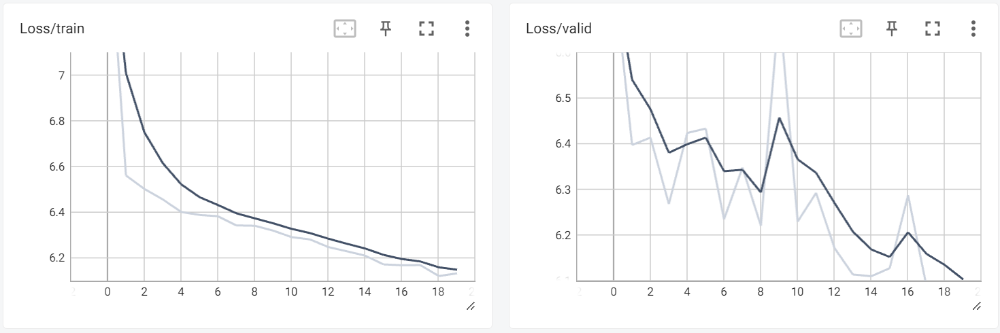

# About 
This repository details the implementation of the BrainEye Take-Home Assignment. It involves developing a deep learning model to predict age from facial images. The goal is to accurately estimate the age of an individual based on their facial appearance and to outline the thought process behind the computer vision pipeline.

# Step 1: Problem definition 
The problem asks for the implementation of a deep learning model that can estimate a person's age based on various observable features from facial images. Age estimation is often performed using computer vision techniques to analyze facial characteristics such as wrinkles, skin texture, and hair color, among others. Computer vision algorithms can estimate an individual's age by comparing these facial attributes with a dataset of known age examples. However, the model's performance (accuracy) can be affected by factors such as image lighting, facial expressions, race, and makeup.

# Step 2: Methodology 
A combination of a Convolutional Neural Network (CNN) and regression is used to create an age estimation model. The simplified CNN architecture is designed for efficient deployment on mobile devices. By utilizing this compact CNN model, we ensure that the model remains computationally feasible while still capturing essential features from the images. The regression component then predicts the numerical age based on the features extracted by the CNN. This approach leverages the strengths of both a compact CNN and regression to develop a straightforward yet effective age estimation model.

## Diagram of the method chosen 


# Step 3: Implementation

## Dataset 
The dataset can be found [here](https://drive.google.com/file/d/1uNA2JzKTtTaGIWtrHsrBUAg2k3eoDZHA/view?usp=drive_link). It contains facial images of people aged between 20 and 50 years. Each folder is named according to the age group it represents.

## 1. Exploratory Data Analysis (EDA)
This repository contains code for exploratory data analysis on a dataset of facial images categorized by age.

<details>
  <summary><b>1. Display sample images</b></summary><br/>


</details>

<details>
  <summary><b>2. Create a CSV File with Labels</b></summary><br/>


</details>
<details>
  <summary><b>3. Age Distribution Analysis</b></summary><br/>


</details>

## 2. Dataset Splitting 
In the age distribution analysis, the dataset is imbalanced. To address this, it is better to use stratified sampling to account for the imbalance in the age feature.

<details>
  <summary><b>Stratified Sampling</b></summary><br/>

Stratified sampling works by dividing the dataset into groups based on the stratification feature (in our case, age). This approach ensures that each group is represented proportionally, which helps address imbalances in the dataset and improves the quality of the analysis. I use `80:10:10` split for train vs valid vs test sets. The data summary is as below:

Train set size: `23976` \
Validation set size: `2997` \
Test set size: `2997`
</details>

<details>
  <summary><b>Distribution Plots for Train, Val and Test sets</b></summary><br/>


We can see that train, test and valid sets have similar age distribution, which indicates a balanced and representative dataset split.
</details>

## 3. Preprocessing and Transformation 
I have defined data preprocessing and transformations in `custom_dataset.py`, which include denoising, deblurring, image resizing, converting images to tensors, and normalizing pixel values.

## 4. Custom Dataset and DataLoader
I use `CustomDataset` to load and preprocess our data, and `DataLoader` to efficiently load, batch, and iterate over the dataset during model training and evaluation. 

## 5. Model 
I implemented a simple CNN with regression component. 

<details>
  <summary><b>SimpleCNN Model Design</b></summary><br/>


<details>
  <summary><b>Summary of Dimensions</b></summary><br/>

  1. Input (RGB image): `128 x 128 x 3`
  2. After 1st Conv + Pool: `64 x 64 x 16`
  3. After 2nd Conv + Pool: `32 x 32 x 32`
  4. After 3rd Conv + Pool: `16 x 16 x 64`
  5. After 4th Conv + Pool: `8 x 8 x 128`
  6. Flattened Size: `8 * 8 * 128`
  7. After 1st Fully Connected: `64`
  8. After 2nd Fully Connected: `1` (we are predicting one numerical value)

The number of filters in the convolutional layers and the number of hidden nodes in the fully connected layers have been selected to keep the total number of parameters under 1 million. ReLU activation functions are used to introduce non-linearity into the model, which is crucial for enabling the network to learn complex patterns and features.

Define SimpleCNN:
```python
model = SimpleCNN(input_dim=3, output_nodes=1, model_name="simple_cnn")
```
</details>

</details>


## 6. Training Process

This repository contains code for the training process of the simple CNN model. 

### Contents
1. [Finding Hyperparameters](#finding-hyperparameters)
2. [Training and Evaluation Loop](#training-and-evaluation-loop)
3. [Plotting Learning Curves with TensorBoard](#plotting-learning-curves)
4. [Save the best model checkpoint as .pth file](#save-the-best-model)

#### Finding Hyperparameters

The code is located in `hyperparameter_tunning.py`.

**This process involves several steps:**

<details>
  <summary><b>1. Train and Overfit the Model on a Small Subset</b>
</summary><br/>

   - Train the model on a small subset of the dataset to assess its ability to learn and identify potential issues with overfitting.
</details>

<details>
  <summary><b>2. Experiment with Learning Rates</b>
</summary><br/>

- Train the model for a few epochs using different learning rates to identify the optimal learning rate for effective training.
- I tested learning rates of `0.001`, `0.0001`, and `0.0005` on the full data with 20 epochs. `0.001` and `0.0005` achieved the best loss, but `0.001` was selected for its faster convergence.
  
  | Learning Rate | Epoch | Final Loss |
  |---------------|-------|------------|
  | 0.001         | 20    | 6.09884    |
  | 0.0001        | 20    | 6.28435    |
  | 0.0005        | 20    | 6.01858    |

</details>

<details>
  <summary><b>3. Optimize Hyperparameters with Weight Decay</b>
</summary><br/>

- Create a small grid search using different values of weight decay and the best learning rates identified in Step 2. Save the results to a CSV file for further analysis. This allows us to examine how weight decay affects the model’s performance.
- I tested the model with weight decay values `0.001`, `0.0001` and `0.00001` on the full data with 30 epochs.

</details>

<details>
  <summary><b>4. Train the Model with Optimal Hyperparameters</b>
</summary><br/>

- Train the model for an extended period using the best hyperparameters obtained from Step 3 to achieve optimal performance.
- Based on my experiments, lr of `0.001` and wd of `0.0001` have been selected for model training.
</details>

#### Training and Evaluation Loop

Training code is located in `train.py` and `functions.py`.

- **Training Loop**: Handles the training process, including forward and backward pass, updating model parameters, and monitoring training metrics.
- **Evaluation Loop**: Evaluates the model on a separate validation set and computes relevant evaluation metrics.

<details>
  <summary><b>Plotting Learning Curves</b>
</summary><br/>

Simple CNN (best model checkpoint): parameters = `621857`, epoch = `23`, valid_loss = `6.09`


From the model's learning curve, we observe that after epoch 23 while the training loss continues to decrease, the validation loss starts to increase. This suggests that the model may be overfitting. Potential causes for this overfitting could include the learning rate, data quality, batch size, or the choice of loss function, among other factors.

Large CNN (best model checkpoint): parameters = `8778049`, epoch = `19`, valid_loss = `6.06`



</details>

#### Inference
The inference function is defined in `inference.py`. This function takes a pre-trained Age Estimation model, an input image and an output image path. It loads the model checkpoint, performs inference on the input image and saves the output image with the estimated age written on it.

<details>
  <summary><b>Inference Pipeline</b>
</summary><br/>


</details>


### Future Improvement 
<details>
  <summary><b>Hyperparameter tunning</b></summary><br />

In the current hyperparameter tuning experiment, the learning rate and regularization parameters were selected with a focus on achieving faster convergence due to time constraints. Future improvements will involve more extensive experimentation with different learning rates, various batch sizes, and additional regularization techniques to better prevent overfitting and optimize performance.

</details>

<details>
  <summary><b>Model</b></summary><br />

To enhance model's capability in capturing complex facial features we can implement very deep architectures, such as [Residual Network(ResNet)](https://huggingface.co/docs/transformers/en/model_doc/resnet). By utilizing deeper models, we can enhance the model's ability in capturing intricate patterns in facial images, leading to more accurate predictions.

</details>

<details>
  <summary><b>Data Transformation</b></summary><br />

In the current data preprocessing solution, in addition to standard data transformations such as resizing and normalization, denoising or smoothing techniques are applied. These techniques help the model to generalize better by focusing on larger patterns rather than fine details, which might be noise.

One potential improvement in data cleaning is to experiment with image sharpening techniques. Sharpening can enhance edges and details, potentially providing the model with more informative features to learn from. 

</details>

<details>
  <summary><b>Data Augmentation</b></summary><br />

Data augmentation techniques, such as random cropping, rotation, scaling, flipping, and color jittering, can help create a more diverse training set. These techniques improve the model's ability to generalize to new, unseen data.

</details>

<details>
  <summary><b>Advanced Loss Function</b></summary><br />

Experiment with advanced loss functions tailored to regression tasks, which might provide better performance compared to the L1 Loss (Mean Absolute Error) currently used in training.

</details>

# Steps to Run the Code:
  1. Create a conda env with environment file provided via:\
    - ```conda env create -f environment.yml```
  2. Activate conda env:\
    - ```conda activate myenv```
  3. Prepare the dataset: \
    - Download dataset [here](https://drive.google.com/file/d/1uNA2JzKTtTaGIWtrHsrBUAg2k3eoDZHA/view?usp=drive_link)
  4. Download the model checkpoint [here](https://drive.google.com/drive/folders/1ry4J5J92-vL4W4S8MVVjzhYbbZDHUc5x?usp=sharing) and place in `checkpoint/` directory
  5. Adjust the configuration: \
    - Edit ```config.py``` to set the dataset path and configure other features as needed. 
  6. To train the simple_cnn model: \
    - ```python3 train.py```
  7. To perform inference with the best model checkpoint: \
    - ```python3 inference.py```


